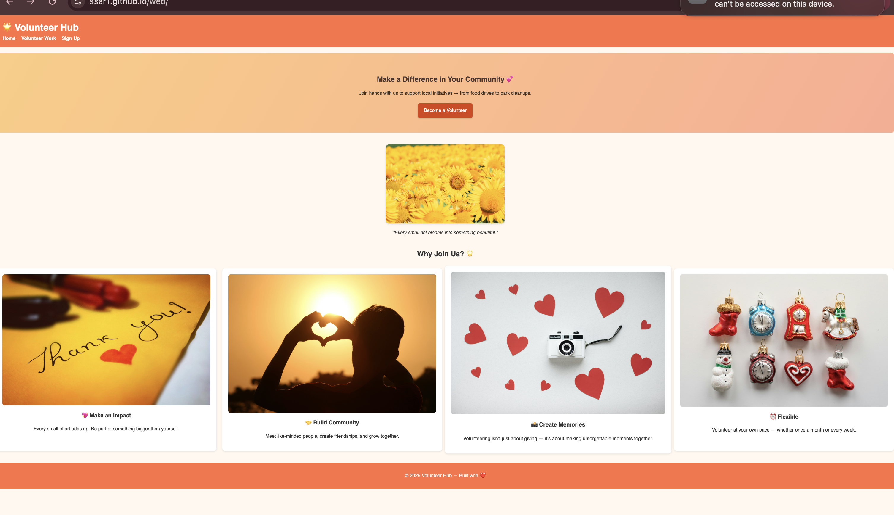
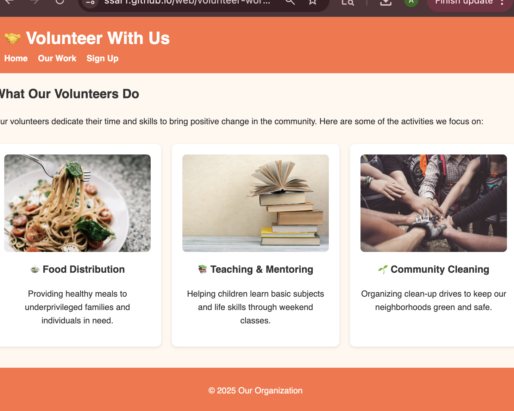
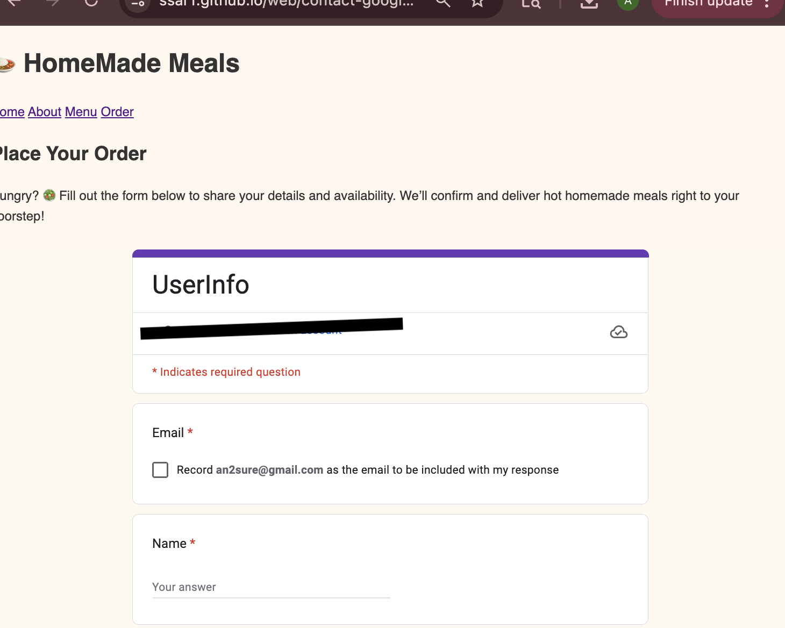

# 🌟 Volunteer Hub Website  

A simple **static website** built with HTML, CSS, and Google Forms to organize volunteer work. The site is hosted for free using **GitHub Pages**.  

## 📖 Project Overview  
This project provides:  
- A **Home Page (index.html)** with introduction and visuals.  
- A **Volunteer Work page (volunteer.html)** describing activities (food drive, park cleanup, tutoring, etc.).  
- A **Sign Up page (contact-google-form.html)** embedding a Google Form to collect volunteer details & availability.  
- Automatic **email notifications** when someone fills the form (via Google Forms → linked Google Sheet notification rules).  

## 🖼️ Features  
- 🎨 Clean, colorful design with responsive CSS.  
- 📋 Easy-to-fill Google Form for sign-ups.  
- 📧 Email notifications for each form submission.  
- 📂 Static site — no backend needed.  
- 🚀 Free hosting on GitHub Pages.  


## 📂 Project Structure

```
.
├── index.html                # Homepage
├── volunteer.html            # About volunteer activities
├── contact-google-form.html  # Sign-up form (Google Form embedded)
├── thanks.html               # Thank you page (optional)
├── styles.css                # Shared CSS styling
└── images/                   # Project images (flower.jpg, food.jpg, park.jpg, kids.jpg, etc.)

```  


## 🚀 How to Run
1. Clone the repo:  
   ```bash
   git clone https://github.com/<your-username>/<repo-name>.git


2. Open any .html file in a browser.

3. Or, publish via GitHub Pages:

   . Go to repo → Settings → Pages.

   . Set branch = main and folder = /root.

   . Access site at: https://<your-username>.github.io/<repo-name>/.

## 📝 Setting up Email Notifications

1. Open your Google Form.

2. Link it to a Google Sheet.

3. In the Sheet → Tools → Notification rules → “A user submits a form → Email right away.”

4. You’ll now get an email for every response. 🎉

## 🌐 Demo Screenshot





